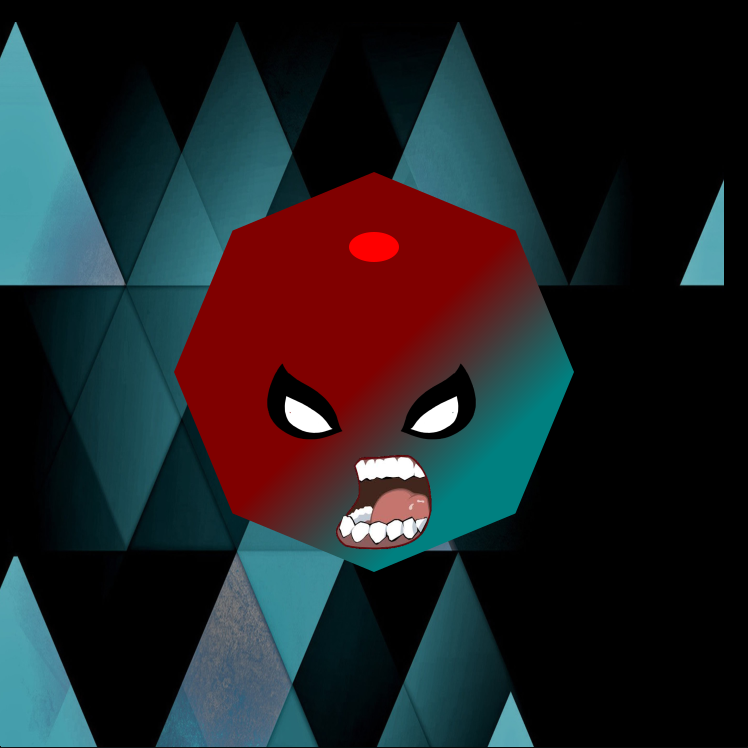

# HaskTron



HaskTron is an implementation of tron in Haskell using Helm as it's game engine .

  - Functional reactive programming imitating elm's style
  - Simple game design open to massive extension


currently I'm dealing with a few issues holding this game back:

> an abnormal amount of cpu (80%+ on the main game screen) used, most likely stemming  from the engine itself.
> 
> dynamically linked lib's/dependencies prevent the game from running/compiling on most machines


### Version
0.0.1

### Tech

HaskTron uses the following open source projects to work properly:

* [Helm] - A functionally reactive game engine

### Installation

```sh
$ git clone https://github.com/omerzk/HaskTron.git HaskTron
$ cd HaskTron
$ cabal install helm
$ runhaskell Setup configure
$ runhaskell Setup build
```
>in my experience helm's installation is trying, have fun.


### Todo's

- web multi-player
- debug cpu usage
- smarter rendering
- decisions ,clean-up excess code


License
----

Mine!


**I don’t want to live in a world where someone else makes the world a better place better than we do.**

[Helm]:http://helm-engine.org/
